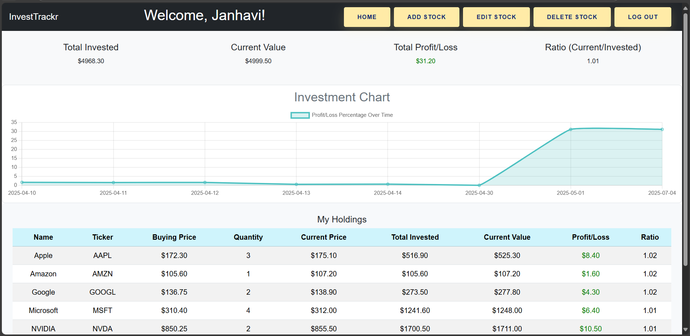

# 📈 InvestTrackr – Portfolio Tracker Dashboard



**InvestTrackr** is a full-stack stock portfolio management application that allows users to track their investments in real time. It provides features such as current stock prices, profit/loss calculations, visual charts, and CRUD operations for stocks.

---

## 🛠 Tech Stack

- **Frontend**: React.js  
- **Backend**: Spring Boot (Java)  
- **Database**: MySQL  
- **API**: Alpha Vantage (for real-time stock prices)

---

## 🚀 Features

- 📊 Add/Edit/Delete stocks
- 💰 Track current value and profit/loss
- 📈 Visualize investment history over time
- 📉 Calculates investment ratio (Current / Invested)
- 🔁 Real-time price updates from Alpha Vantage API

---

## 📸 Dashboard Preview

> Below is a sample dashboard showing total investments, current value, profit/loss summary, and a holdings table:


---

## 🧪 Getting Started

### 🧾 Prerequisites

- Node.js (v14+ recommended)
- Java 17+ and Maven
- MySQL
- Internet access (for stock API)

---

## 📦 Backend Setup (Spring Boot)

1. **Clone the repository**

```bash
git clone https://github.com/your-username/portfolio-tracker.git
cd portfolio-tracker/stock-tracker
```

2. **Configure application.properties**

Inside `src/main/resources/application.properties`, use:

```properties
spring.datasource.url=jdbc:mysql://127.0.0.1:3306/stock_tracker
spring.datasource.username=root
spring.datasource.password=root
spring.jpa.hibernate.ddl-auto=update
spring.jpa.properties.hibernate.dialect=org.hibernate.dialect.MySQLDialect

# Logging for debugging
logging.level.org.springframework=DEBUG
logging.level.com.example.stock_tracker=DEBUG

# Alpha Vantage API Key
stock.api.alpha-vantage.key=76O1LGJA04AOGBBX
```

3. **Run Spring Boot**

```bash
./mvnw spring-boot:run
```

✅ Ensure MySQL is running and the `stock_tracker` database exists.

---

## 💻 Frontend Setup (React)

1. **Navigate to frontend folder**

```bash
cd ../portfolio-tracker
```

2. **Install dependencies**

```bash
npm install
```

3. **Start the development server**

```bash
npm start
```

Your app should now be running on `http://localhost:3000`.

---

## 📂 Project Structure

```
portfolio-tracker/
├── public/
├── src/
│   ├── components/
│   ├── services/
│   └── App.js

stock-tracker/
├── src/
│   └── main/
│       ├── java/com/example/stock_tracker/
│       └── resources/
│           └── application.properties
```

---

## 🔐 API Key Setup

This app uses the [Alpha Vantage API](https://www.alphavantage.co/).  
Make sure your key is valid and within usage limits.

---

## 📊 Future Enhancements

- 🧾 User login and authentication
- 🎨 Light/Dark mode
- 📈 Advanced analytics (volatility, moving averages)
- 📤 Export holdings to PDF or Excel

---

## 🤝 Contributing

Feel free to fork this repo and contribute. All ideas and PRs are welcome!

---

## 📃 License

This project is open-source and free to use under the MIT License.

---

## 🙋‍♀️ Author

**Janhavi Naik** – Developer of InvestTrackr  
_B.Tech CSE @ IIIT Surat | Passionate about full-stack and finance-tech apps_

---
